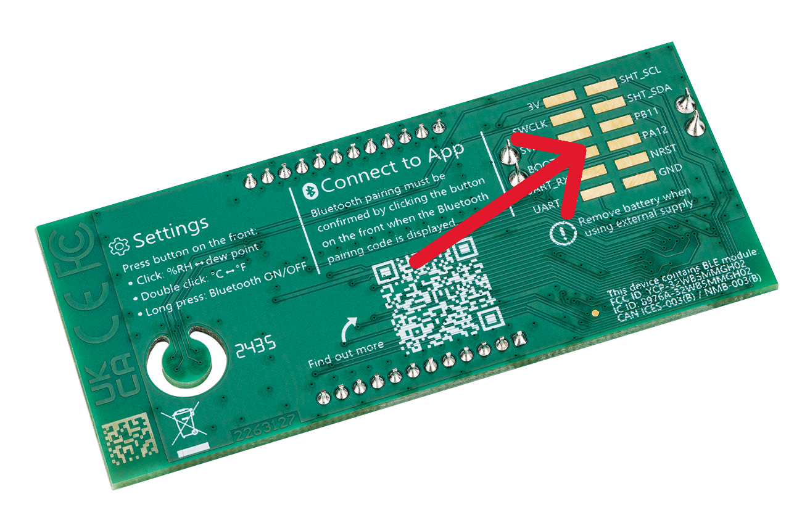

# SHT43 DemoBoard Firmware

The SHT43 Demo Board is a new Sensirion device to demonstrate an application of the Sensirion SHT43 humidity and temperature sensor. It is battery powered and able to communicate with other devices over Bluetooth Low Energy. The board has an [STM32WB55xx](https://www.st.com/en/microcontrollers-microprocessors/stm32wb55rg.html) dual core low power wireless device from ST on it.

The firmware in this repository provides an application for this board that integrates with the Sensirion MyAmbiance app.

[](https://play.google.com/store/apps/details?id=com.sensirion.myam&hl=en_IE) [](https://apps.apple.com/ch/app/sensirion-myambience/id1529131572)


## Structure Overview

This firmware is based on the [STM32CubeWB SDK](https://github.com/STMicroelectronics/STM32CubeWB).
Even though [STM32CubeMX](https://www.st.com/en/development-tools/stm32cubemx.html) generates a working application skeleton, we do not use all of the generated sources but implement our own application structure.

The folders containing source code are:

- **`./lib`**
    All SDK files needed by this firmware are generated by the the [STM32CubeMX](https://www.st.com/en/development-tools/stm32cubemx.html) application into the lib folder. This includes all hardware drivers that are used by the firmware.
    The used version of STM32CubeMX is 6.8.0. The project file `./lib/lib.ioc` is the source of the generated output. All peripheral configurations can be looked up and found in this project file.

    All implementations in `./lib` are left untouched and use the coding style as defined by ST.
    The subfolder `./lib/shared` contains application specific header files that may contain few manual modifications needed to adjust compile time constants.

- **`./st_app`**
    The folder `./st_app` contains the system initialization (boot up, irq settings, heap management). The structure of the code is left as defined by ST or the STM32CubeMX generator.

- **`./source`**
    The source code in the `./source` folder is defining the real application. It is solely developed for the SHT43 DemoBoard. Within this subfolder
    the project specific code style is enforced by clang-format.


The full documentation of the software is available on [GitHub Pages](https://sensirion.github.io/sht43-demoboard-ble-firmware)

## Building the application

The application can be built on Windows or Linux hosts by installing the required tools and starting the build from the command line. Alternatively you can download our docker image and use docker to build the application.

This section will explain both options.

### Local build on host system with installed toolchain

#### Code checks and formatting

Before building the source we first check if it conforms to our coding style and if it has a standard formatting. Our toolchain will reject any code that does not pass these checks. You can perform these checks locally before pushing the code.

Required tools:

|Tool|Version|
|------------|-------:|
|[editorconfig-checker](https://github.com/editorconfig-checker/editorconfig-checker)|2.0.3|
|[clang-format](https://clang.llvm.org/docs/ClangFormat.html)|14.0.0|
| [cppcheck](https://cppcheck.sourceforge.io/)|2.7|
| [clang-tidy](https://clang.llvm.org/extra/clang-tidy/)|14.0.0|
|[codespell](https://github.com/codespell-project/codespell)|2.2.5|

How these tools are used in the build workflow you can see in the file
`./build_scripts/check.sh`.


To interactively standardize the formatting of all `.c` and `.h` files just use the following command in a bash shell.

```bash
find source -type f -iregex ".*\.\(c\|h\)" -exec clang-format --i -style=file {} \;
```

#### Compile and link

The application is built using [CMake](https://cmake.org/). To setup the compilation step you will need to install some prerequisites.

Required tools:

|Tool|Version|
|------------|-------:|
|[CMake](https://cmake.org/)|3.22.1|
|[Ninja](https://ninja-build.org/)|1.10.1|
|[gcc-arm-none-eabi](https://developer.arm.com/downloads/-/gnu-rm)|10.3-2021.10|


Build the **release** configuration:

```bash
cmake -B build/release -DCMAKE_MAKE_PROGRAM=ninja -DCMAKE_BUILD_TYPE=release -G Ninja
cmake --build build/release
```

Build the **debug** configuration:

```bash
cmake -B build/debug -DCMAKE_MAKE_PROGRAM=ninja -DCMAKE_BUILD_TYPE=debug -G Ninja
cmake --build build/debug

```

#### Building the documentation

The code is documented using doxygen comments. The toolchain enforces documentation on functions with their inputs and outputs, type definitions, global variables and macros.
To build the documentation we use [Doxygen](https://www.doxygen.nl/) and [PlantUML](https://plantuml.com/).


Required tools:

|Tool|Version|
|------------|-------:|
|[Doxygen](https://www.doxygen.nl/)|1.9.7|
|[PlantUML](https://plantuml.com/)|1.2020.02|


The `Doxyfile` in `./documentation/doxygen` needs to be updated to let *Doxygen* find your *PlantUML* installation.

```text
PLANTUML_JAR_PATH      = <location of PlantUML .jar file>
```

The document generation is tarted with:

```bash
doxygen documentation/doxygen/Doxyfile
```


### Local build using docker

Since it is quite time consuming to install the complete toolchain, we have prepared a docker image that includes all of it.
Of course you will require an actual installation of docker on your host machine.

[Getting started with Docker](https://www.docker.com/get-started/)

Once you have installed the docker engine on your host you can proceed with the following steps.

#### Getting the docker image

In order to access the registry you will require to get a personal access token and to login to the registry. The full process of authentication and login to the github docker register is described [here](https://docs.github.com/de/packages/working-with-a-github-packages-registry/working-with-the-container-registry).

After login to the docker registry you can get the image with the following command:

```bash
docker pull ghcr.io/sensirion/sht43-demoboard-docker:main
```

#### Starting and using the docker image

When starting the image you should mount the checked out repository folders into the docker image.
Start the docker image with this command:

```bash
docker run -i --rm -v <absolute path to checkout folder>:/workdir -e workdir='/workdir' ghcr.io/sensirion/sht43-demoboard-docker:main
```

After this command you are in an interactive shell of the started docker container. Your repository is mounted in the folder `./workdir`

The scripts to trigger the individual steps of the build workflow are located in `./workdir/build_scripts`.

**Execute the tool chain**

```bash
cd ./workdir
./build_scripts/check.sh
./build_scripts/build_source.sh
./build_scripts/build_docu.sh

```

**Note:** If you already executed a build using the locally installed toolchain you will need to delete the `./build` folder first. Otherwise cmake of the docker will not be able to properly initialize the build tree!

## Setup wired connection with host

To debug the application and to load a new built application you require a wired connection to the host. To establish this you will need to solder a connector to the designated pads on the backside of the board.


All the twelve pads are labeled. Not all of them are required to be connected to J-TAG. The table below lists all the pins and their connection to the J-TAG connector.


|SHT43 pad | J-TAG connector|
|----------|----------------|
|3V (connect to supply)       | VTref (connect to same supply as Demo Board)         |
|SWCLK     | JTAG-SWDCLK    |
|SWDIO|JTAG-SWDIO|
|BOOT (not needed)| - |
|UART_RX (receive data)| -|
|UART_TX (for tracing)| - |
|SHT_SCL| -|
|SHT_SDA|-|
|PB11|-|
|PB12|-|
|NRST|JTAG-RESET|
|GND| JTAG-GND|


## Loading the application to the SHT43 DemoBoard

Once you have setup the connection between host and SHT43 Demo-Board the built firmware can be loaded to the SHT43 Demo Board using [STM32CubeProgrammer Software](https://www.st.com/en/development-tools/stm32cubeprog.html). The best option is to use the .hex file.

Alternatively you can download the firmware also with a debugger (e.g. [Ozone](https://www.segger.com/products/development-tools/ozone-j-link-debugger/technology/tool-overview/)) attached to the J-TAG pins of the device.
