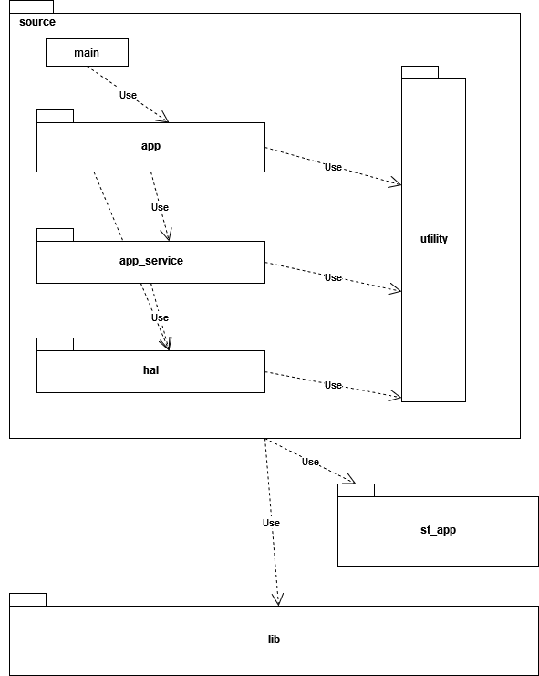

# Application structure of the SHT43 DemoBoard {#doc_app_structure}

The following figure gives an overview of the application structure of the DemoBoard firmware.

The package names are reflected by the folder structure. The subsequent sections describe the packages that are shown in this diagram.

## lib
The package `lib` is the library that is linked to the firmware.

The folder `lib` contains the sources generated by STM32CubeMX. There are three categories of artifacts generated by STM32CubeMX:
- **Library code:** The folders `Drivers`, `Middlewares`, `Utilities` contain the ST code to control the STM32WB55xx module.
- **Shared include files:** The folder `shared\include` contains the headers that are copies of header files that where
  originally generated by STM32Cube for this specific application. All the header files in this folder are required to build the application and the library.

  Some of them have manually been modified to meet the demands of the application. When modifying the configuration and STM32Cube regenerates all sources, it should be checked if some updates are required. If so, the files in the folder `shared\include` need to be adapted again.
- **Application skeleton code:** This code is used as example how to use the STM SDK and the hardware.
- System startup code and linker file: The startup code  and linker file are used without modification but are not part of the library.
- **Informational content:** The file `lib.ioc` can be opened with SMT32CubeMX. It contains all definitions that are used to generate the contents of the folder lib.

The sources that are used to build the library are listed in the file `CMakeList.txt`

## st_app
`st_app` is a package that logically belongs to some application layer but contains unchanged code that was generated by Cube. The code is compiled with the rest of the main application.

## source
`source` contains the firmware code for the SHT43 DemoBoard that is using the `lib` and the code from `st_app`.
The application as the layers `app`, `app_service`, `hal` and `utility`. Each layer serves a specific purpose. The layers `app`, `app_service`, `hal` have a hierarchy. `app` is the topmost layer and `hal` the bottommost.  Lower layers must not reference the upper layers. The `utility` package is not part of this hierarchy as it contains code that must be usable by any other package.
On top of these packages there is the entry point of th application in the compilation unit (CU) main.

### app
The package `app` contains gadget specific behavior. This defines how the system starts up, what is displayed on the LCD screen, usw. To implement these behaviors the `app` layer uses functionality of the other layers.

### app_service
The package `app_service` provides complex functionalities that can easily be used by the `app`. An example uf such a service is the screen  module. It provides a high level interface to write symbols on the LCD screen without being specific about a representation of a application mode. It knows nothing about an application state and what would be appropriate to show on the screen at a specific time.
Other application services are the TimerServer and the HciTransport.

### hal
Even though we do not implement any driver within the `source` of the DemoBoard all the used peripherals need to be initialized and configured. These configurations and initializations are implemented in the `hal` layer.
Most of the implementations are derived from code that was originally generated by STM32CubeMX under `lib\Core\Src`.

### utility
Some functionalities are used throughout the entire application. As this package can be referenced by any other package, care must be taken to avoid cyclic references.
