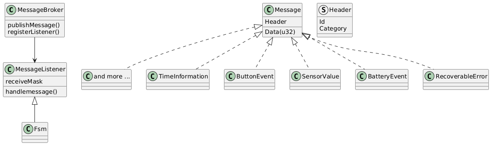
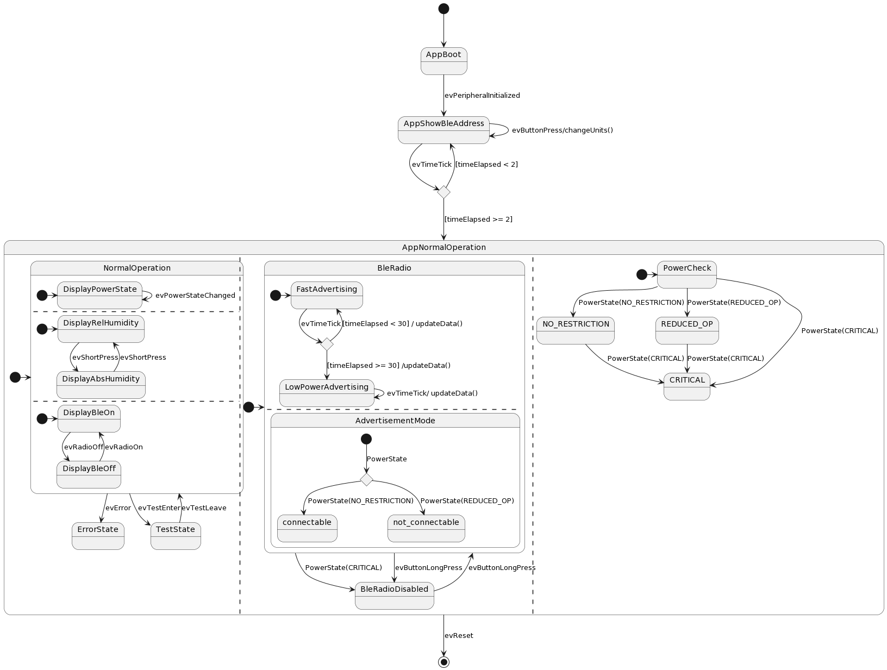

# Software Architecture {#doc_app_architecture}

## Static Decomposition

The software has the layers **utility**, **hal**, **app_service** and **app**. These layers are reflected by the folder structure of the software repository. A detailed description of this structure can be found [here](./application_structure.md)

## Dynamic Decomposition

The main application is executed on the Cortex-M4 microprocessor and the wireless stack is executed on a Cortex-M0 coprocessor. These two processors interact using a mailbox mechanism and a shared RAM portion. The coprocessor firmware is delivered as a binary and cannot be changed. It is used as a black box through the host command interface (HCI).

Even though the main application does not make use of an operating system, it uses the [ST sequencer](https://wiki.st.com/stm32mcu/wiki/Utility:Sequencer), which provides some notion of tasks. In this context, a task is a function without parameters that can be interrupted, suspended and resumed at a later stage in the same position where it was interrupted. Technically, tasks are a kind of co-routines that keep their state on the stack. It is important to understand that the tasks can only resume operation when the subsequent active tasks have terminated! Therefore, a task must not include an infinite loop, but it will be triggered many times depending on some condition.

The demo board application includes the following tasks:

|Task-ID| Task function | Description|
|:---| :---|:---|
|SCHEDULER_TASK_HANDLE_HCI_EVENT = 0   | hci_user_evt_proc | Service the HCI mailbox used for the inter processor communication. This process may send an ACI/HCI command when the svc_ctl.c module is used.|
|SCHEDULER_TASK_HANDLE_BLE_MESSAGE = 1 | RunBleMessageDispatch | Dispatch the messages in the Ble application domain. During the message processing functions of the HCI may be called. This may include sending BLE commands|
|SCHEDULER_TASK_HANDLE_SYSTEM_HCI_EVENT = 2| shci_user_evt_proc | Service the System HCI mailbox used for the inter processor communication. This process will NOT send BLE commands!|
|SCHEDULER_TASK_HANDLE_FLASH_OPERATION = 3| FlashTask | The flash task is used to control erase of several sectors.|
|SCHEDULER_TASK_HANDLE_APP_MESSAGES = 4| RunAppMessageDispatch| Dispatch the messages that deal with application logic that is independent from BLE|

The tasks with ID < 2 interact directly with the BLE subsystem. As these calls are synchronous, all other tasks that were active before will stay inactive until this operation is finished. Therefore, it is important that these tasks are scheduled first and do not block the rest of the system. Such a task will only be resumed by either an interrupt or another task which can be scheduled later on. That's the reason for setting the task IDs of tasks that deal with BLE before the others.

### Finate state machines (FSM)

Tasks are a convenient way to execute a sequential piece of work and to provide some degree of parallelism. In this application we have many entities that have states and the behavior changes when a state changes. To simplify the modeling of states, we have introduced a finite state machine framework.
The following figure gives an overview of this framework.

A state machine (FSM) is a message listener. The messages it receives are the events that are handled by the state machine. Each state of a state machine is modeled by a function that does the handling of the message.
On application startup, the FSM's are registered within a `MessageBroker`. When an event occurs, the message is published through the function `MessageBroker_PublishMessage`. The message will be put into a queue and dispatched afterward to every registered listener. During the dispatch of the message, every interested FSM will process this message and eventually update its state.

Due to the restrictions that apply to tasks, we have two message domains (MessageBokers), one for application messages and one for the BLE subsystem. Within the application message domain, no calls to the HCI are allowed!
Application messages will be forwarded to the BLE subsystem, but not vice versa. The dispatching of the messages is done as a dedicated task. A task processes one message at a time and schedules itself again if the message queue is not empty.

## Application States

The application behavior can be represented by a state diagram and is implemented by many FSM's. An overview of this state behavior is shown in the figure below.

Just after reset, the application goes into the **AppBoot** state in which the peripherals are initialized.
After initializing the peripherals, the event **evPeripheralInitialized** triggers the application to enter its main loop.
At first, it displays the BLE-address for two seconds. After this short time, it enters the state AppNormalOperation. In this state, many things happen in parallel:

- *NormalOperation*: Regular readout of sensor data and update the display with the new values.
- *Ble Radio*: If not disabled, the sensor values are published in a proprietary advertisement data package. The rate of publishing data is reduced after some time.
  When the battery degrades, the device cannot be connected anymore.

- *PowerCheck States*: The system is always in one of the power states:
  - NO_RESTRICTION: The battery has enough capacity to support all use cases.
  - REDUCED_OP: The battery capacity does not allow connecting the device.
  - CRITICAL: The remaining battery capacity is critical and thus does not allow any BLE or flash operation.

## Interrupts

In order to allow the Software to work in parallel to the hardware many hardware blocks are operated in interrupt mode or using a DMA channel. In any case this requires that some interrupts are enabled and one interrupt triggered function does not depend on another function that requires an interrupt with lower priority.
This section lists the used interrupts, what they are used for and their priority as they are defined.

|Peripheral|Description| Interrupt prio|
|:---| :---|:---|
|SysTic_IRQ| Priority of the system tick: the system tick is used in timing functions.| TICK_INT_PRIORITY=4|
|RTC_WKUP_IRQ| Wake up interrupt of real time clock; this is the clock that is running during stop mode to wake up the system in regular time intervals| IRQ_PRIO_RTC_WAKE_UP = 3|
|LCD_IRQ| Irq used by LCD screen; the IRQ is enabled but no software function depends on it.| 0|
|ADC1_IRQ| Irq used by ADC1; signals the end of a battery voltage measurement.| IRQ_PRIO_APP=5 |
|EXTI15_10_IRQ| Interrupt of the external interrupt trigger lines 10-15. The user button is attached to this interrupt| IRQ_PRIO_APP=5 |
|I2C3_EV_IRQ|Event to synchronize I2C with DMA| IRQ_PRIO_SYSTEM=0 |
|DMA1_Channel2_IRQ; DMA1_Channel3_IRQ|DMA channels used for I2c transmit and receive| IRQ_PRIO_SYSTEM=0|
|DMA1_Channel1_IRQ|DMA used by Quad-SPI. In the normal application Quad-SPI will not be in use at all.| IRQ_PRIO_SYSTEM=0|
|QUADSPI_IRQ|In the normal application Quad-SPI will not be in use at all.| 0|
|USART1_IRQ| The receive interrupt of the USART is used to receive test commands.| IRQ_PRIO_APP=5 |
|DMA1_Channel4_IRQ| The Uart module exposes a function to write asynchronously using the DMA1-Channel4| 0|
|HSEM_IRQ| Interrupt generated from hardware semaphores; used in synchronization between Cortex M0 and Cortex M4| IRQ_PRIO_SYSTEM=0|
|IPCC_C1_RX_IRQ;IPCC_C1_TX_IRQ| Used in synchronization between Cortex M0 and Cortex M4| IRQ_PRIO_SYSTEM=0 |

The system tick is used in various HAL timing functions such as HAL_GetTicks(). With these IRQ settings it should become
possible to use synchronous debug traces in interrupt routines of interrupt handlers with priority IRQ_PRIO_APP.
(In release build there should not be any debug traces!)

## Testing

The firmware is capable to receive input from the host and trigger predefined operations.
During test, the **NormalOperation** state can be forced into a TestState where it
does not update the display anymore.
For now this only works if a debugger is attached as USART is not able to wake-up the device from lower power mode stop2.
