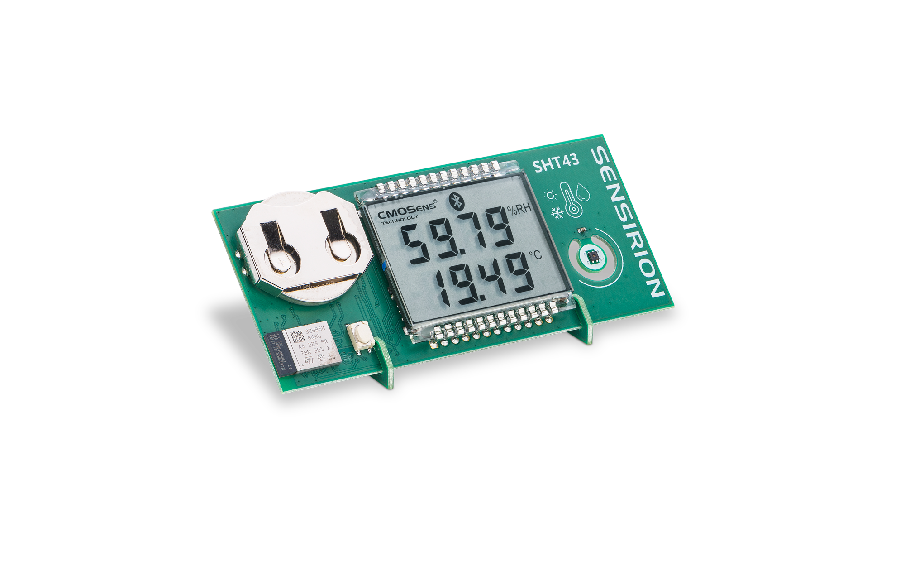

# SHT43 DemoBoard Firmware

## SHT43 DemoBoard

The SHT43 DemoBoard is a new Sensirion device to demonstrate an application of the Sensirion SHT43 humidity and temperature sensor.

It is battery powered and able to communicate with other devices over Bluetooth Low Energy. The board has an [STM32WB55xx](https://www.st.com/en/microcontrollers-microprocessors/stm32wb55rg.html) dual core low power wireless device from ST on it.

##Firmware

The firmware in this repository provides an application for this board. This documentation describes the main concepts and architecture and includes the generated comments on all types and functions.
